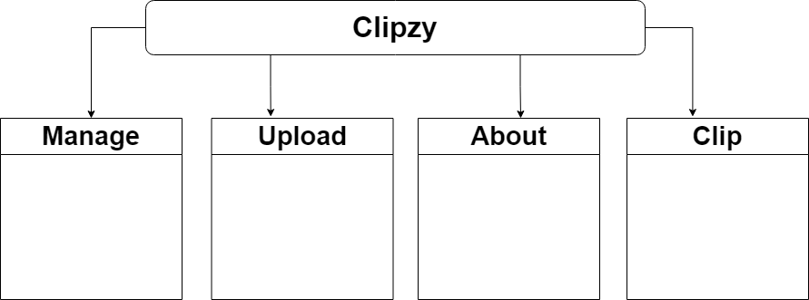

# Clipzy: Share Clips Of competitve games moments shared by people.

## The Purpose
Clipzy is a portfolio project to demonstrate the skills in angular framework.

---
## The technology stack & tools
The Application built using tools such as: Firebase, Netlify, RxJs, Angular auth, tailwind.
The Project followed the design pattern MVC.

---
## The Layout of app (sketch)

A Quick sketch using figma to draw lines to inform the designers and gain insights how the site will be. But, most importantly this sketch isn't the final design the website will follow it's just an initial layouts.

---
### Landing Page

A Landing page where clients can see a hero section & navbar & previews of other clips users uploaded.

We have at the navbar a logo for the website, login / register, about button and language of the website.

---
### Manage Section

It's a page that have a navbar to navigate through the website, This page can't be accessed by non-users. The manage page contains a bar that have 2 buttons whether to sort clips or upload which will redirect you to /upload page where users can upload their own clip. At the bottom we have the user own uploaded clips and whether to delete it or edit the title of certain clip.

---
### Upload Section

It's only to signed-in users to access this page. This page serve as the uploading page for clips. Those clips will be uploaded through drag & drop method or regular upload button which open an explore window to your own system to select the desired video.

---

### About Section

A Simple about page to tell the story behind the website.. nothing else.

---
### The sitemap

The website have 4 main routes each serve different purpose which are:
- Manage: After Login-in in user account this section appear, Which serve as the managing panel to upload another clip or manage your uploaded clips whether to edit the title or delete it from your account.
- Upload: After Login-in in user account this section appear, A Single panel to upload your desired clip that doesn't exceeds 25 MB or any type other than mp4.
- About: A Single page that appears to all users or non-users to tell the story behind this website.
- Clip: A page where users or non-users can watch clips that has been uploaded to this website. 

## Updates
- 8 Feb 22, Fixing the CORS & SharedArrayBuffer  problems with Firebase.
- 7 Feb 22, ~~Currently the application have problem with the new "Netlify" hosting that's been using the CORS + SharedArrayBuffer.. Since the Last two hosting for this project was in Heroku then Vercel.. But it's not working anymore..~~

